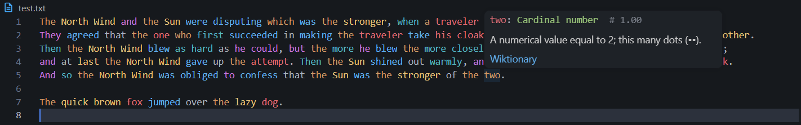

# Natural Syntax LSP

Parts-of-speech, semantic-embedding, or dependency-parse highlighting for VS Code or Neovim via a local Go LSP server running ONNX inference. Hover over any word to see its tag (and, in dependency mode, its relation and dependents) plus a Wiktionary definition.

Three modes:

- **POS mode** (default) — BERT/MobileBERT classifies each word's part of speech and maps it to a VS Code semantic token type (color determined by your theme).
- **Semantic mode** — `all-mpnet-base-v2` (default) or `all-MiniLM-L6-v2` turns each word into a vector describing its meaning in context, and words used alike get similar colors. Colors are pushed via a custom `$/nls/semanticColors` LSP notification and applied as VS Code `TextEditorDecorationType` decorations (full hex, not theme-limited).
- **Dependency mode** — a biaffine Universal Dependencies parser ([diaparser](https://github.com/Unipisa/diaparser), default checkpoint `en_ewt.electra-base`) assigns each word a syntactic head and UD relation label (`nsubj`, `obj`, `amod`, …). Words are colored by relation category, and hovering a word shows its relation and dependents in the same `word: label` YAML style as the other modes.

## Installation

### From a GitHub Release (recommended)

Download the `.vsix` from the [latest release](../../releases/latest) and install:

```bash
code --install-extension natural-syntax-ls-*.vsix
```

The VSIX bundles the prebuilt server binary and ONNX Runtime shared library for your platform (Windows x64, Linux x64, macOS arm64), so no Go toolchain is needed.

You still need to export the ONNX model files (Python + pip):

```bash
scripts/setup.sh                     # BERT-base POS model (~430 MB)
scripts/setup.sh --model mobilebert  # lighter POS model (~105 MB)
scripts/setup.sh --model mpnet       # semantic mode, all-mpnet-base-v2 (~440 MB)
scripts/setup.sh --model minilm      # semantic mode, all-MiniLM-L6-v2 (~92 MB)
scripts/setup.sh --model dependency  # dependency mode, en_ewt.electra-base UD parser (~470 MB)
scripts/setup.sh --model all         # all models
```

(`scripts/setup.ps1 -Model <...>` on Windows, same values.)

Model files go to `%APPDATA%\natural-syntax-ls\` (Windows) or `~/.config/natural-syntax-ls/` (Linux/macOS).

### From source

Requires Go, Python, Node.js.

```bash
scripts/setup.sh   # exports models, builds binary

cd vscode-extension
npm install
npx vsce package
code --install-extension natural-syntax-ls-0.1.0.vsix
```

To use your own binary instead of the bundled one, set in VS Code settings:

```json
"naturalSyntaxLs.serverPath": "/path/to/natural-syntax-ls"
```

### Neovim

The server is a standard stdio LSP, so it works in Neovim too: POS and dependency coloring, hover, mode switching, and (with a small handler) semantic-mode colors. Setup and snippets: [docs/neovim.md](docs/neovim.md).

## Models

| Model                           | Size    | Mode       | Notes                                                                                                                                         |
| ------------------------------- | ------- | ---------- | --------------------------------------------------------------------------------------------------------------------------------------------- |
| `bert-base-cased` (default)     | ~430 MB | POS        | Higher accuracy (multilingual vocab inflates size)                                                                                            |
| `mobilebert`                    | ~105 MB | POS        | Faster startup                                                                                                                                |
| `all-mpnet-base-v2` (default)   | ~440 MB | Semantic   | 768-dim, 110M params, best quality                                                                                                            |
| `all-MiniLM-L6-v2`              | ~92 MB  | Semantic   | 384-dim, 22M params, faster, lower quality                                                                                                    |
| `en_ewt.electra-base` (default) | ~470 MB | Dependency | diaparser biaffine UD parser (ELECTRA-base encoder); pass `--model <diaparser-catalog-name>` to `export_model.py` for other languages/corpora |

One setting, `naturalSyntaxLs.model`, picks the model for whichever mode is active — its meaning depends on `naturalSyntaxLs.mode`: a POS model name for `pos`, an embedding model name for `semantic`, or a diaparser catalog name for `dependency`. Model file names on disk (`{slug}.onnx` / `{slug}_vocab.txt`, or `{slug}_dependency.onnx` / `{slug}_dependency_vocab.txt`) are derived from this value using the same slug rule as `export_model.py` (`-`, `.`, `/` → `_`), so it must match what you exported.

## Settings

| Setting                                 | Default                     | Description                                                          |
| --------------------------------------- | --------------------------- | -------------------------------------------------------------------- |
| `naturalSyntaxLs.serverPath`            | `""` (bundled binary)       | Path to the Go binary                                                |
| `naturalSyntaxLs.mode`                  | `pos`                       | `pos`, `semantic`, or `dependency`                                   |
| `naturalSyntaxLs.model`                 | `bert-base`                 | Model name; meaning depends on `mode` (see above)                    |
| `naturalSyntaxLs.filetypes`             | `["plaintext", "markdown"]` | Language IDs to activate on                                          |
| `naturalSyntaxLs.scoreThreshold`        | `null` (0.333)              | Minimum confidence to highlight (POS mode)                           |
| `naturalSyntaxLs.tokenMapUpdate`        | `{}`                        | Override POS → token type mappings                                   |
| `naturalSyntaxLs.wiktionaryDefinitions` | `true`                      | Show Wiktionary definitions in hover                                 |
| `naturalSyntaxLs.semanticLightness`     | `0.75`                      | OKLCH lightness for semantic colors (0–1); increase for light themes |
| `naturalSyntaxLs.semanticChroma`        | `0.14`                      | OKLCH chroma of the most vivid semantic colors                       |

## POS Tag Colors (POS mode)

Tags map to VS Code semantic token types; color comes from your theme. Full list: [posList.md](docs/posList.md).

Hover shows the Part of Speech and a Wiktionary definition (when available).

## Semantic Mode Colors

For each document, the server lays every word out on a 2D map, choosing the view where that document's words are most spread out. A word's direction on the map sets its hue and its distance from the middle sets how vivid it is. Words used in similar ways land close together, so they get similar colors. The map is updated as you type and lined up with the previous one, so colors stay steady. Colors are per document and don't depend on your theme.

All colors share one lightness. `semanticLightness` (default 0.75) sets it; increase it for light themes. `semanticChroma` (default 0.14) sets the most vivid words' intensity.

How it works, in depth (the math, the code, and its time and memory costs): [semantic-colors.md](docs/semantic-colors.md).

Hover shows the hex color code and a Wiktionary definition (when available).

## Dependency Mode Colors

Each word is colored by its Universal Dependencies relation, one relation per token type/modifier pair. Full list: [deprelList.md](docs/deprelList.md).

Hover shows the word's relation to its head, then the words that depend on it under `dependents:` (marked `# has dependents` when they have their own), plus a Wiktionary definition (when available):

## Troubleshooting

If POS mode tags nearly every word as "Foreign word" or other nonsense tags with low confidence, the exported `bert_base.onnx` / `bert_base.onnx.data` pair is likely stale or corrupt. Re-export with `scripts/setup.sh --model bert-base` (or `scripts/setup.ps1 -Model bert-base`), or switch to `mobilebert` in the meantime.

## Test

Open [test.txt](docs/test.txt) in VS Code after installation. For semantic mode, [semantic-example.txt](docs/semantic-example.txt) shows animals, food, technology and feelings each getting their own color family.

Words color within ~10 seconds (POS), ~5 seconds (semantic) or ~15 seconds (dependency). Hover any word to see its tag and Wiktionary definition.


