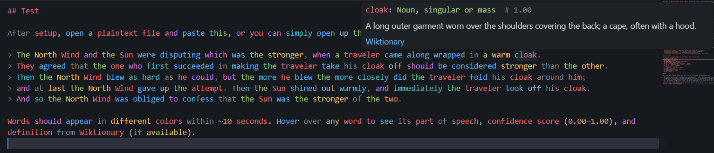

# Natural Syntax LSP

Parts-of-speech, semantic-embedding, or dependency-parse highlighting for VS Code via a local Go LSP server running ONNX inference. Hover over any word to see its tag (and, in dependency mode, its head/dependents) plus a Wiktionary definition.

Three modes:

- **POS mode** (default) — BERT/MobileBERT classifies each word's part of speech and maps it to a VS Code semantic token type (color determined by your theme).
- **Semantic mode** — `all-mpnet-base-v2` (default) or `all-MiniLM-L6-v2` embeds each word into a high-dimensional vector, projects it onto a 2D plane, and maps the angle to a continuous OKLCH color. Similar words get similar colors. Colors are pushed via a custom `$/nls/semanticColors` LSP notification and applied as VS Code `TextEditorDecorationType` decorations (full hex, not theme-limited).
- **Dependency mode** — a biaffine Universal Dependencies parser ([diaparser](https://github.com/Unipisa/diaparser), default checkpoint `en_ewt.electra-base`) assigns each word a syntactic head and UD relation label (`nsubj`, `obj`, `amod`, …). Words are colored by relation category, and hovering a word shows its head/dependents as a small rendered tree (via the bundled `nlsdep` grammar in `vscode-extension/syntaxes/`).

## Installation

### From a GitHub Release (recommended)

Download the `.vsix` from the [latest release](../../releases/latest) and install:

```bash
code --install-extension natural-syntax-ls-*.vsix
```

The VSIX bundles the prebuilt server binary and ONNX Runtime shared library for your platform (Windows x64, Linux x64, macOS arm64), so no Go toolchain is needed.

You still need to export the ONNX model files (Python + pip):

```bash
scripts/setup.sh             # BERT-base POS model (~400 MB)
scripts/setup.sh --model mobilebert  # lighter POS model (~100 MB)
scripts/setup.sh --model mpnet       # semantic mode, all-mpnet-base-v2 (~110 MB)
scripts/setup.sh --model minilm      # semantic mode, all-MiniLM-L6-v2 (~22 MB)
scripts/setup.sh --model dependency  # dependency mode, en_ewt.electra-base UD parser
scripts/setup.sh --model all         # all models
```

(`scripts/setup.ps1 -Model <...>` on Windows, same values.)

Model files go to `%APPDATA%\natural-syntax-ls\` (Windows) or `~/.config/natural-syntax-ls/` (Linux/macOS).

### From source

Requires Go, Python, Node.js.

```bash
scripts/setup.sh   # exports models, builds binary

cd vscode-extension
npm install
npx vsce package
code --install-extension natural-syntax-ls-0.1.0.vsix
```

To use your own binary instead of the bundled one, set in VS Code settings:

```json
"naturalSyntaxLs.serverPath": "/path/to/natural-syntax-ls"
```

## Models

| Model | Size | Mode | Notes |
|---|---|---|---|
| `bert-base` (default) | ~400 MB | POS | Higher accuracy |
| `mobilebert` | ~100 MB | POS | Faster startup |
| `all-mpnet-base-v2` (default) | ~110 MB | Semantic | 768-dim, BERT-base scale, best quality |
| `all-MiniLM-L6-v2` | ~22 MB | Semantic | 384-dim, faster, lower quality |
| `en_ewt.electra-base` (default) | ~50 MB | Dependency | diaparser biaffine UD parser; pass `--model <diaparser-catalog-name>` to `export_model.py` for other languages/corpora |

One setting, `naturalSyntaxLs.model`, picks the model for whichever mode is active — its meaning depends on `naturalSyntaxLs.mode`: a POS model name for `pos`, an embedding model name for `semantic`, or a diaparser catalog name for `dependency`. Model file names on disk (`{slug}.onnx` / `{slug}_vocab.txt`, or `{slug}_dependency.onnx` / `{slug}_dependency_vocab.txt`) are derived from this value using the same slug rule as `export_model.py` (`-`, `.`, `/` → `_`), so it must match what you exported.

## Settings

| Setting | Default | Description |
|---|---|---|
| `naturalSyntaxLs.serverPath` | `natural-syntax-ls` | Path to the Go binary |
| `naturalSyntaxLs.mode` | `pos` | `pos`, `semantic`, or `dependency` |
| `naturalSyntaxLs.model` | `bert-base` | Model name; meaning depends on `mode` (see above) |
| `naturalSyntaxLs.filetypes` | `["plaintext", "markdown"]` | Language IDs to activate on |
| `naturalSyntaxLs.scoreThreshold` | `null` (0.333) | Minimum confidence to highlight (POS mode) |
| `naturalSyntaxLs.tokenMapUpdate` | `{}` | Override POS → token type mappings |
| `naturalSyntaxLs.wiktionaryDefinitions` | `true` | Show Wiktionary definitions in hover |
| `naturalSyntaxLs.semanticLightness` | `0.75` | OKLCH lightness for semantic colors (0–1); increase for light themes |
| `naturalSyntaxLs.semanticChroma` | `0.14` | OKLCH chroma (color intensity) for semantic colors |

## POS Tag Colors (POS mode)

Tags map to VS Code semantic token types; color comes from your theme.

| Tag | Meaning | Token Type |
|---|---|---|
| VB, VBD, VBG, VBP | Verb | `function` |
| VBN, VBZ | Verb (past participle / 3rd person) | `method` |
| NN, NNS | Noun | `variable` |
| NNP, NNPS | Proper noun | `namespace` / `typeParameter` |
| JJ, JJR, JJS | Adjective | `type` / `struct` / `interface` |
| PRP$, WP, WP$ | Possessive / wh-pronoun | `property` / `regexp` |
| RB, RBR, RBS, WRB | Adverb / wh-adverb | `enumMember` |
| IN, RP, SYM, POS | Preposition / particle / symbol | `operator` |
| CC, EX, MD, PRP, TO | Conjunction / modal / pronoun | `keyword` / `modifier` |
| DT, PDT, WDT | Determiner | `macro` |
| CD | Cardinal number | `number` |
| LS | List item marker | `decorator` |
| FW, UH | Foreign word / interjection | `string` |
| O | Other | `comment` |

## Semantic Mode Colors

Each word is embedded by `all-mpnet-base-v2` (default) or `all-MiniLM-L6-v2`, projected onto a fixed 2D plane via two orthogonal random unit vectors, and the angle maps to a hue in OKLCH color space (perceptually uniform lightness). Similar words get similar hues. The color is not theme-dependent.

Default: OKLCH(0.75, 0.14, hue). Adjust `semanticLightness` and `semanticChroma` for your theme.

Hover shows the hex color code and a Wiktionary definition (when available).

## Dependency Mode Colors

Each word is colored by its Universal Dependencies relation category (theme token type, like POS mode — not literal hex colors):

| Relations | Meaning | Token Type |
|---|---|---|
| nsubj, csubj | Subjects | `variable` (declaration) |
| obj, iobj | Objects | `variable` |
| ccomp, xcomp | Clausal complements | `function` |
| advcl, acl | Adverbial / adnominal clauses | `function` (modification) |
| amod | Adjectival modifier | `type` |
| advmod | Adverbial modifier | `type` (modification) |
| nmod, appos, nummod | Nominal dependents | `property` |
| aux, cop | Auxiliaries / copula | `keyword` |
| mark, case | Subordinators / adpositions | `operator` |
| det | Determiners | `macro` |
| cc, conj | Coordination | `operator` (static) |
| compound, fixed, flat, goeswith | Multiword units | `namespace` |
| discourse, vocative, expl | Discourse elements | `string` |
| root | Sentence root | `class` (declaration) |
| punct | Punctuation | `comment` (deprecated) |
| everything else (dep, clf, list, orphan, parataxis, reparandum, dislocated) | Uncommon relations | `modifier` |

Hover a word to see its head and dependents rendered as a small tree, plus a Wiktionary definition (when available).

## Test

Open a plaintext file and paste:

> The North Wind and the Sun were disputing which was the stronger, when a traveler came along wrapped in a warm cloak.
> They agreed that the one who first succeeded in making the traveler take his cloak off should be considered stronger than the other.
> Then the North Wind blew as hard as he could, but the more he blew the more closely did the traveler fold his cloak around him;
> and at last the North Wind gave up the attempt. Then the Sun shined out warmly, and immediately the traveler took off his cloak.
> And so the North Wind was obliged to confess that the Sun was the stronger of the two.

Words color within ~10 seconds (POS) or ~5 seconds (semantic). Hover any word to see its tag and Wiktionary definition.


